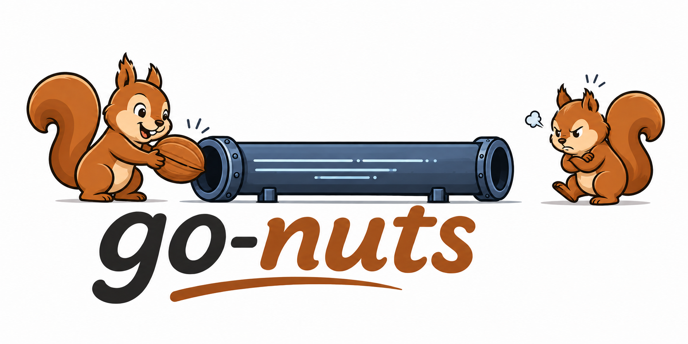

<p align="center">
  
</p>

# go-nuts

Connection-lifecycle helpers for [NATS](https://nats.io) pull consumers in Go —
a small, dependency-light layer over
[`nats.go`](https://github.com/nats-io/nats.go) for connecting, draining, and
shutting down cleanly.

## Install

```
go get github.com/entireio/go-nuts
```

## What it provides

- **`Connect`** — dial with a resilient default posture: reconnect-forever (so a
  long-lived service rides out a NATS outage instead of permanently closing
  after the client's default 60 attempts), a bounded drain timeout, optional
  rotation-aware mTLS, and lifecycle log handlers that don't mistake a clean
  shutdown for a fault.
- **`Drain` / `IsShutdownFetchErr`** — graceful shutdown. `Drain` starts
  nats.go's asynchronous drain and blocks until the connection flushes and
  closes (bounded by a timeout); `IsShutdownFetchErr` lets a fetch loop treat a
  drain/close during shutdown as a clean exit rather than an error.
- **`ShutdownGroup`** — cancels tracked background loops, waits for them to
  return, then drains the registered connections — the ordering that keeps a
  `Drain` from racing an in-flight `Fetch`.

## Usage

```go
ctx, stop := signal.NotifyContext(context.Background(), os.Interrupt, syscall.SIGTERM)
defer stop()

g := nuts.NewShutdownGroup(ctx)
nc, err := nuts.Connect(g.Context(), natsURL, nuts.WithName("worker"))
if err != nil {
	return err
}
g.AddConn("worker", nc)

g.Go(func(ctx context.Context) {
	for {
		// Stop fetching once the group is shutting down, so the loop returns
		// before its connection is drained (Shutdown cancels, joins, then
		// drains — the loop must observe the cancel to keep that ordering).
		if ctx.Err() != nil {
			return
		}
		msgs, err := sub.Fetch(1, nats.MaxWait(5*time.Second))
		switch {
		case errors.Is(err, nats.ErrTimeout):
			continue // idle poll
		case nuts.IsShutdownFetchErr(ctx, err):
			return // clean shutdown: connection drained/closed
		case err != nil:
			// Real error — log/metric, then back off so a fast-failing Fetch
			// (e.g. connection closed mid-run) does not busy-spin the CPU.
			slog.ErrorContext(ctx, "fetch failed", slog.Any("error", err))
			select {
			case <-ctx.Done():
			case <-time.After(time.Second):
			}
			continue
		}
		handle(msgs)
	}
})

<-ctx.Done()
g.Shutdown() // cancel loops → join → drain, in that order
```

By default `Connect` builds mTLS from the `ENTIRE_INTERNAL_TLS_{CERT,KEY,CA}_FILE`
environment variables; use `WithTLSConfig`, `WithoutTLS`, or the other `Option`s
to override.

## Development

Requires Go 1.26. Tasks via [mise](https://mise.jdx.dev): `mise run test`,
`mise run lint`, `mise run fmt`.

## License

MIT — see [LICENSE](./LICENSE).
